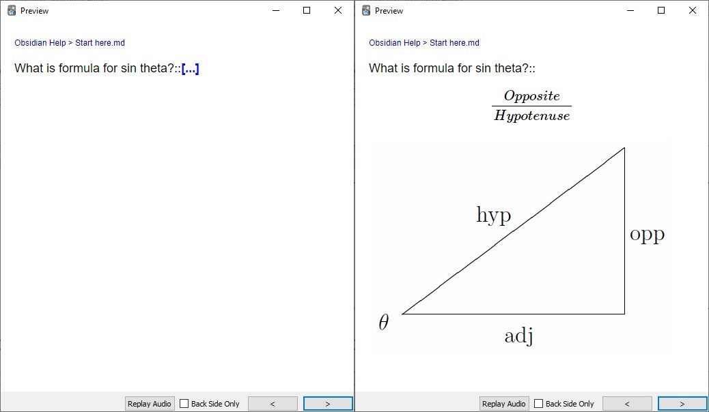
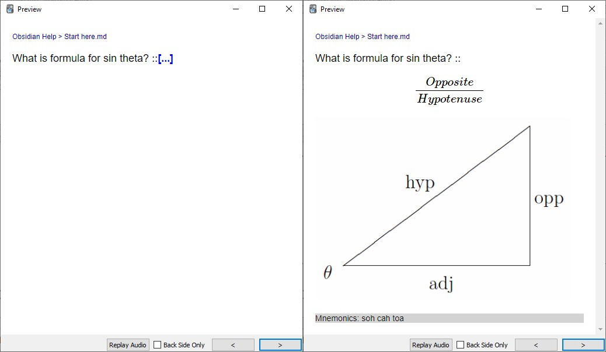
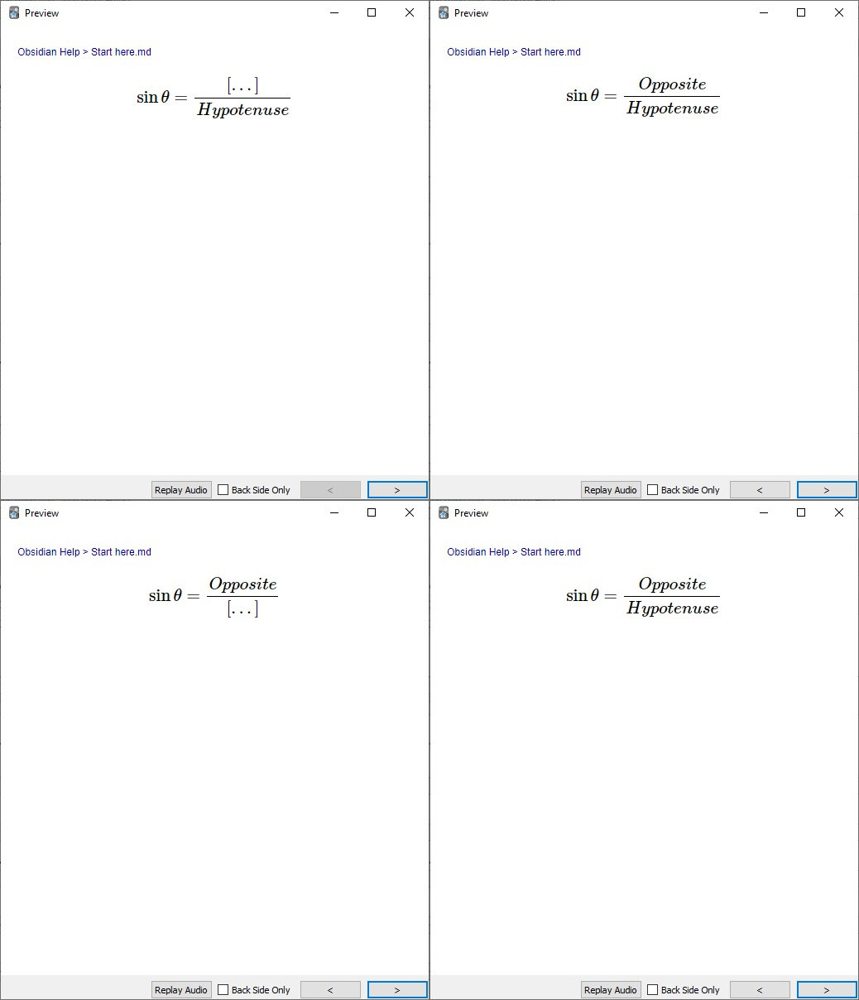

# Introduction

Obsidian Anki Sync uses HTML (or, if you prefer to say XML) like syntax to make flashcards.

If you know HTML, you would recall, html code consists of elements. Similarly, we have blocks.

We can declare them as:

```markdown
<!-- basicblock-start -->
What is formula for sin theta?::
$$\frac{Opposite}{Hypotenuse}$$

<!-- basicblock-end -->
```

This would generate this card:



Easy as that! 😀

## Attributes on a block basis

Each such block can have attributes or options that override the default behavior.

For example, by default the cards will be generated in `Default::ObsidianAnkiSync` deck, but but using the deck attribute we can override it to something else. For this example, we are going to override it to deck `Math`.

```markdown
<!-- basicblock-start deck='Math' -->
What is formula for sin theta?::
$$\frac{Opposite}{Hypotenuse}$$

<!-- basicblock-end -->
```

This would create the same card but in deck `Math`.

There are many other attributes like **extra** for specifying extra field etc..

## Attributes on a file basis

Some attributes like deck can be specified in file basis by using YAML frontmatter.

```markdown
---
deck: Math
---
<!-- basicblock-start extra="Mnemonics: soh cah toa" reverse="true" -->
What is formula for sin theta?::
$$\frac{Opposite}{Hypotenuse}$$

<!-- basicblock-end -->
```

This would create two cards in same deck `Math` due to deck property specified on a file basis. 

Also, it will have an extra field as specified and there will be a reverse card created unlike above two examples due to extra and reverse attributes specified on a block basis.

The new card will look like:



# Different Blocks in Obsidian Anki Sync

## basicblock

It is used make forward and reversed cards.

Several examples already shown above.

## replaceblock

It is used make cloze cards. It suports Anki's cloze card syntax.

```markdown
<!-- clozeblock-start -->
The capital of Japan is {{c1:: Tokyo}}
<!-- clozeblock-end -->
```

This would generate the card:


## replaceblock

This is a special block that creates clozes by replacing the specified text.

```markdown
<!-- replaceblock-start -->
<!-- replace id="1" text="Opposite" -->
<!-- replace id="2" text="Hypotenuse" -->
$$\sin \theta = \frac{Opposite}{Hypotenuse}$$
<!-- replaceblock-end -->
```

This would generate the cards:


